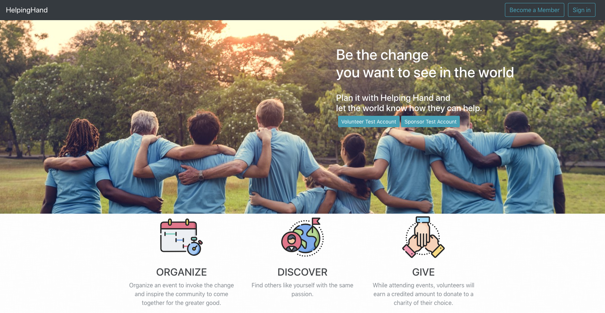
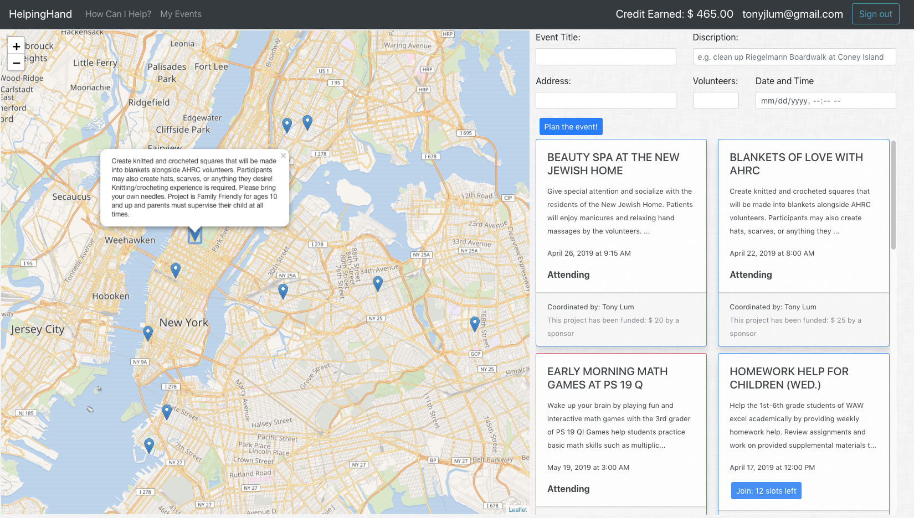
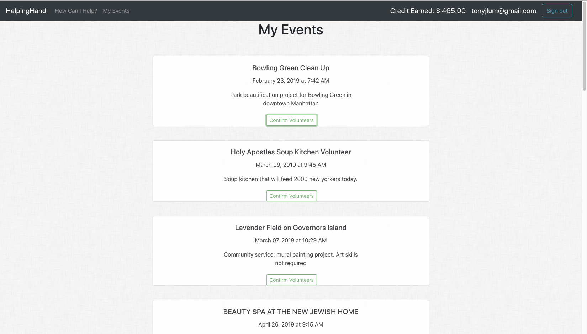
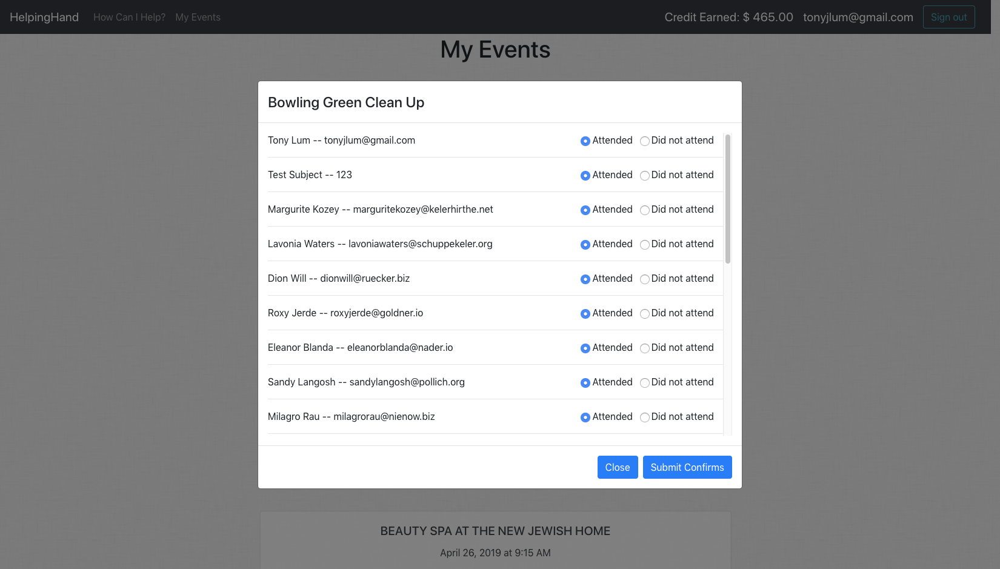
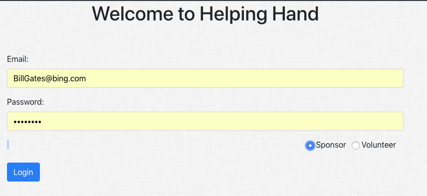
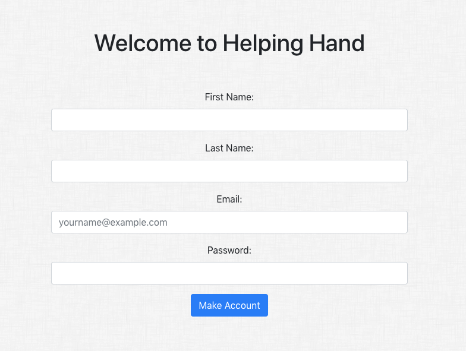

# Helping Hand
[HelpingHand](https://helpinghand-app.herokuapp.com) Live Demo - Coming Soon!

HelpingHand is full-stacked web application for bringing volunteers and philanthropists together to support their communities with their resources. It allows users to plan events to solve problems they see in their community (e.g. the Boardwalk at Coney Island could use some help cleaning up prior to the beach opening). It allows sponsors to fund these events to entice individuals to come volunteer and also ensures that the event is successful. The volunteers do not earn the money for themselves, but they are able earn a credit to donate to a cause of their choice. For both volunteer and sponsor, a single action, whether it is volunteering or sponsoring, will leads to multiple benefits. A volunteer can help their community and donate to a charity that may only accept monetary aid. A Sponsor can ensures that the community event that need human resources can be successful as well as see all of the charities where their contributions ultimately end up. The app it built on the React.JS library with React Router, Leaflet, Redux architectural framework and styled with React Bootstrap.

## Contents

- [Getting Started](#getting-started)
- [Structure](#structure)
- [Containers and Components](#containers-and-components)
  - [Homepage](#homepage)
  - [Users](#user)
  - [Volunteer's Events](#volunteers-events)
  - [Sponsor's Donations](#sponsors-donations)
  - [Signup & Login](#signup&login)
- [Future Development](#future-development)

## Getting Started
To install the apps dependencies, use: `npm install`. The API github repo can be found at https://github.com/Tonyjlum/mod5api. The default API link is to a live database on Heroku, but can be changed in ENDPOINT variable in ./src/const.js .

In the project directory, you can run: `npm start`.
Open [http://${window.location.hostname}:3000](http://${window.location.hostname}:3000) to view it in the browser.
The page will reload if you make edits. You will also see any lint errors in the console.

## Structure
The top-level folder includes the public folder, which contains the index.html where the app is officially rendered by React, an src folder which holds the most of the react components, App.js, const.js, index.js and a few other files.
- app.js handles the routes and which component will render at those routes.
- const.js handles the constant variables that are reused throughout the app.
- index.js contains the Redux reducers and

## Containers and Components
The app has a few major sections (primary components and containers are listed):
#### Homepage
The homepage details the purpose of the app as well as allow visitors to login with a guest account for both volunteer and sponsor.
- homepage.js and homepagebottom.js



#### User
The user page is the primary interaction that volunteers and sponsors will be using. It contains the the leaflet map, creating a new event, sponsoring events, and view all upcoming events. This container will function dynamically based on which type of account is signed in. If location tracking is allowed, the map will center on the users locations. Other wise it will center to downtown Manhattan.
```
changeLocation = (event) => {
  const position = {latitude: event.lat, longitude: event.long}
  this.props.addLocationToStore(position)
}
```
When a event is clicked, the map will center over the event. Events will have a blue ring if they have been sponsored and a red ring if it has yet to be sponsored.
- donationmodal.js, event.js, map.js, newevent.js, event_container.js, and user_container.js




#### Volunteer's Events
The events page for volunteers show all of their events as well as handle the confirmations of their past events where they were the coordinator.
  - confirmvolunteers.js and  myeventcontainer.js





#### Sponsor's Donations
The donations page for sponsors show all of their contributions to the events they are supporting.
  - donationscontainer.js


#### Signup & Login
The login and new account pages allows users to login to their account or create a new account. The login page has a account type selector through radio buttons.
 - loginform.js and newaccountform.js

<!-- 

 -->


## Future Development
At the moment, events have full CRUD functionality and users have basic account management. There are a few additions and edits I would like to see in the app:
  - Mass email system to let volunteers and sponsors know about any updates to the event.
  - Leave reviews for the coordinator of the event, the volunteers who attend the event, and the event itself.

  - Volunteers:
    - adding the functionality to donate the amount they have earned to a charity of their choice.
    - search and filter out upcoming events and the events they are attending
    - watch an event and receive an alert if they become sponsored.
  - Sponsors
    - see a list of locations and how much of a contribution they have made to a particular charity.
    - add a method for adding funds to their account or link to a banking account.
    - print out a statement to use as 1099 tax deduction.

## Contact
Feel free to reach out for any reason
  - Tonyjlum@gmail.com
  - [Linkedin](https://www.linkedin.com/in/tony-lum/)
